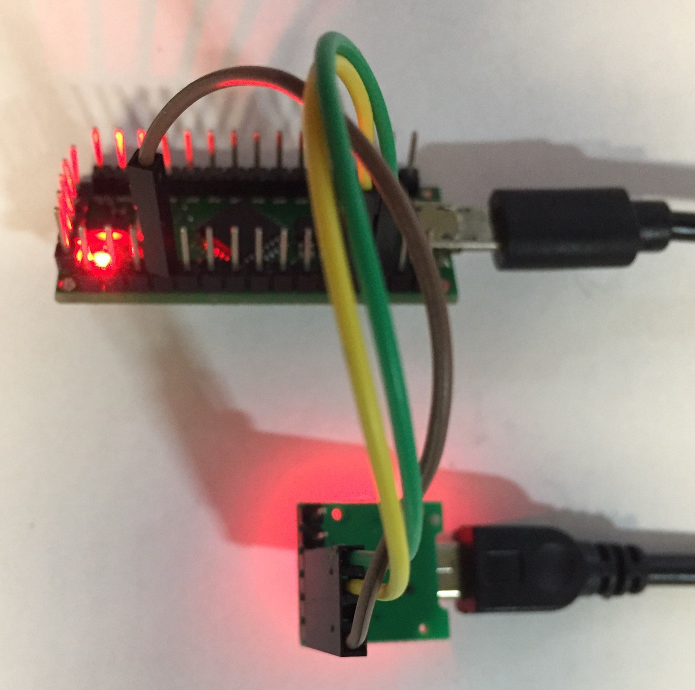

# MODBUS client (slave) on Arduino

This sample demonstrates the deployment of MODBUS client (slave) on Arduino board. The sample provides the Arduino firmware to be flashed onto the board, and a Python script that uses pymodbus module to perform the MODBUS requests to the Arduino board.




## Design

The Arduino board is a MODBUS device that provides data from 3 sensors. First two sensors are single value, third sensor provides a vector of 3 values (e.g. temperature, pressure and 3D coordinate). MODBUS interface of Arduino is configured to do the following:

1. Allow the user to choose which sensors are active via a bitmask register
2. Provide the current sensor values to the user
3. Each time a successful MODBUS transaction is made, the sensors values are incremented by 1

The second part of the sample is a Python script for the host computer. According to the provided `pymodbus` code, the host computer acts as a MODBUS server, which does the following:

1. Chooses which sensors are active
2. Reads the sensors values from Arduino device via MODBUS registers


## Preparation

The sample uses two Serial interfaces: hardware (via builtin CDC-ACM) and software (pins 10 & 11). In order to use the software serial, additional USB-UART adapter is required.


## Usage

1. Connect the Arduino board via microUSB connector to the laptop USB Type A and launch minicom for it at baud rate 9600:

```
►minicom -D /dev/ttyACM1
Welcome to minicom 2.8

OPTIONS: I18n
Port /dev/ttyACM1, 20:43:55

Press CTRL-A Z for help on special keys

MODBUS: request handled successfully
MODBUS: request handled successfully
MODBUS: request handled successfully
```

2. Connect the Arduino board pins 10 & 11 to the latop USB Type A via USB-UART adapter and execute the script:
```
►python3 ./Client.py /dev/ttyUSB0
Value1 = 2
Value2 = 2
Value3 = 2, 2, 2
Value1 = 3
Value2 = 3
Value3 = 3, 3, 3
Value1 = 4
Value2 = 4
Value3 = 4, 4, 4
Value1 = 5
Value2 = 5
Value3 = 5, 5, 5
Value1 = 6
Value2 = 6
Value3 = 6, 6, 6
```

You should see the logs as demonstrated above.

